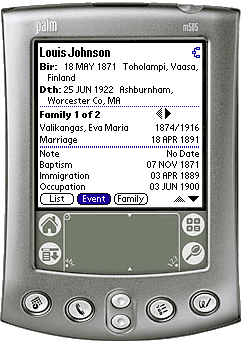
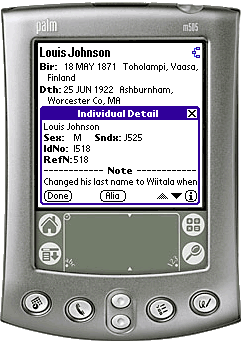
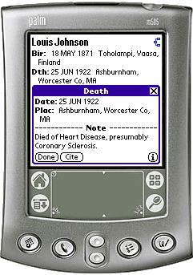
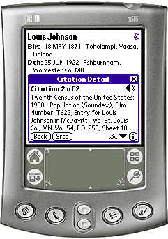
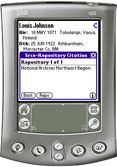

# gedwise63 Palm Pilot
This repository contains source file for the GedWise 6.3 application written in C for Palm OS devices. The application was created by Daniel Rencricca.

### GedWise Running on a Palm Pilot

### GedWise Running on a Palm Pilot - Individual Screens

